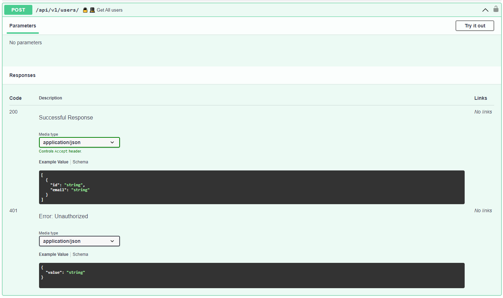
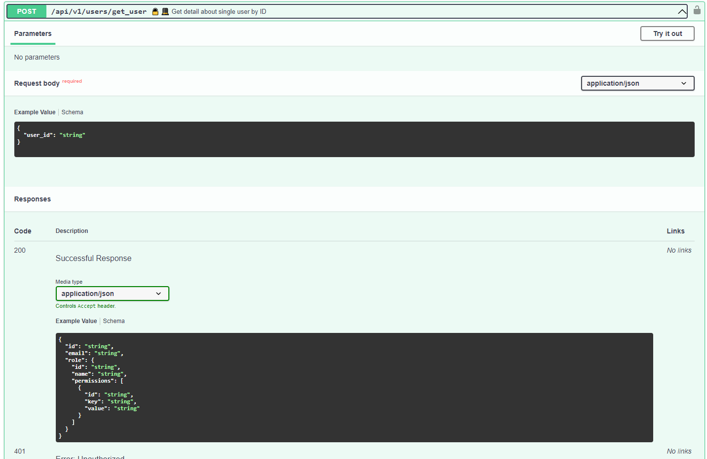
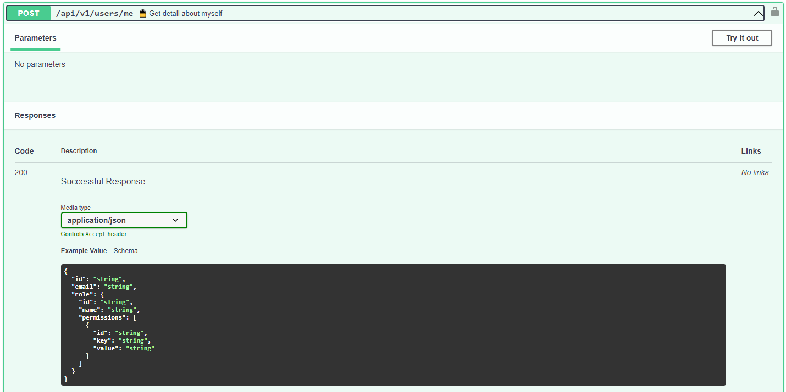
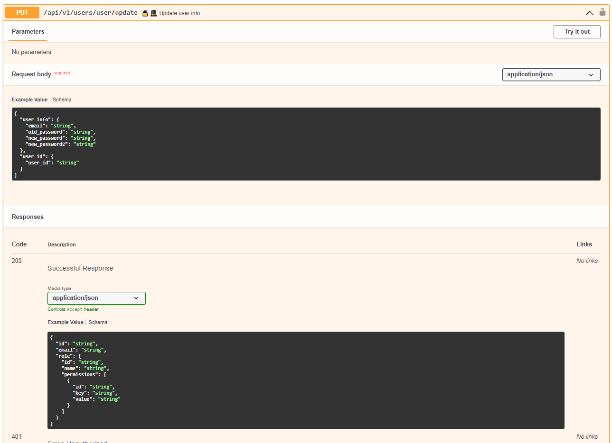
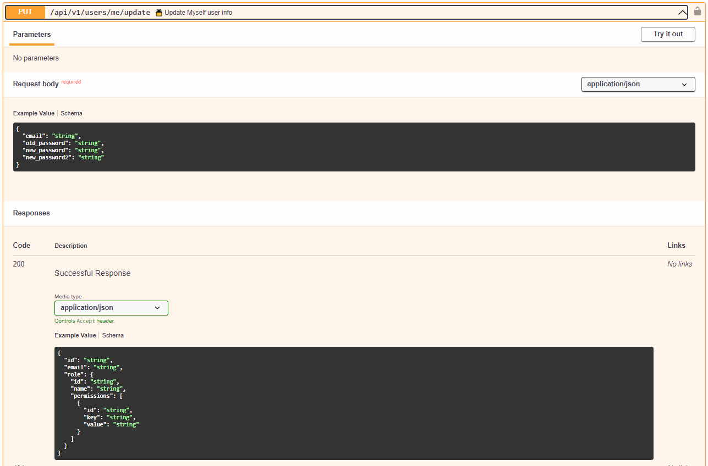
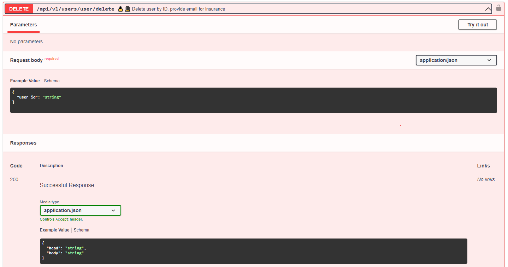
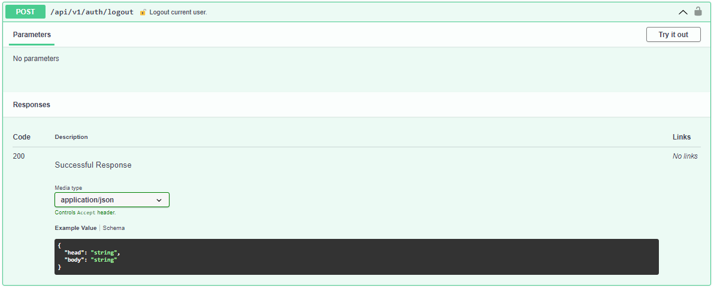
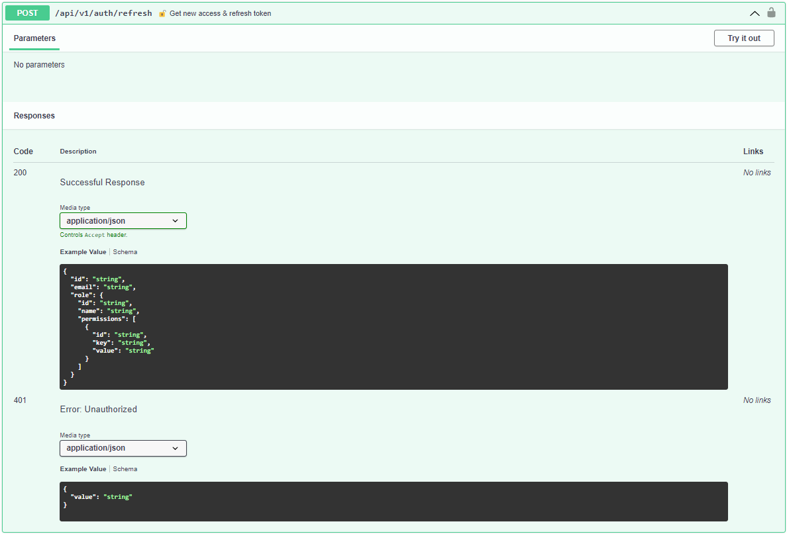
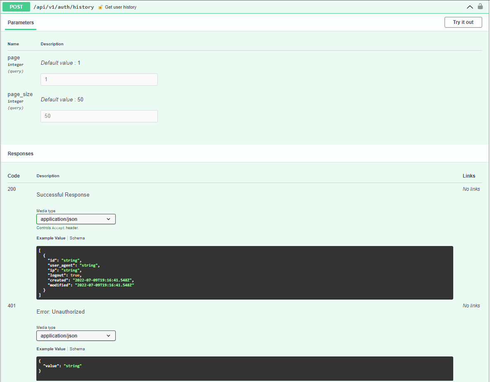
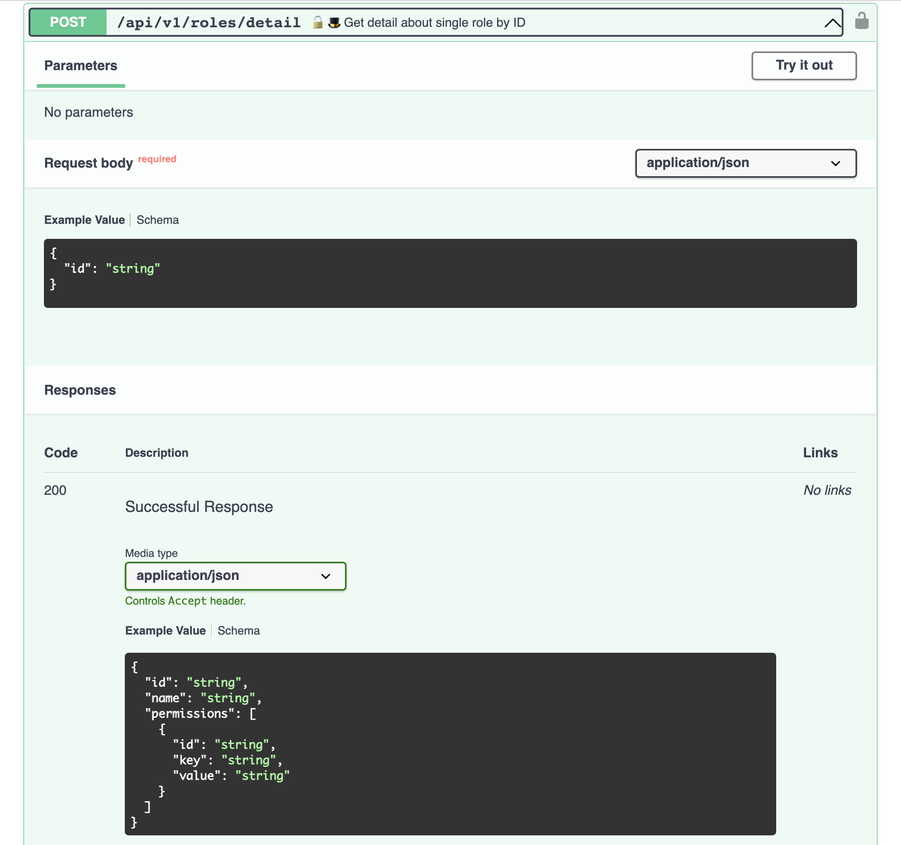

# База данных


Схема PostGrees 


Для хранения **refresh token** используется таблица PG UserHistory.refresh_token.

Для хранения невалидных **access token** используется Redis.

Валидные **access token** не храняться на сервере и передаются при каждом обращении клиента к серверу.

Схема Payload:
```
{
  "user_id": user_id,
  "email": email,
  "role_id": role_id
}
```


#API

# API/users


## API/users/

    **Параметры:**
    1) access_token

    **Выходное значение:**
    Cписок данных о пользователях из БД 

    Логика:
    1) Проверка уровня доступа, доступ для админа
    2) Выдача информации из БД по всем пользователям



## API/users/get_user

	**Параметры:**
    1) access_token
    2) user_id

    **Выходное значение:**
    Полная информации из БД по пользователю в виде словаря

	Логика:
    1) Проверка уровня доступа в access_token, доступ для админа
	2) Выдача полной информации из БД по user



## API/users/me

	**Параметры:**
    1) access_token

    **Выходное значение:**
    Полная информации из БД по пользователю (себе) в виде словаря

	Логика:
    1) Проверка уровня доступа в access_token
	2) Выдача полной информации из БД по user



## API/users/me/permission/{permission_id}

	**Параметры:**
    1) access_token
    2) permission_id

    **Выходное значение:**
    Информация из БД по запрошенному доступу у пользователя 

    Логика:
    1) Проверка уровня доступа в access_token
    2) Выдача информации по запрошенному доступу пользователя из БД


## API/users/register:

	**Параметры:**
	1) email
	2) password
	3) password confirm

    **Выходное значение:**
    Общая информация о созданном пользователе (user_id, email)

	Логика:
	1) проверка на совпадение username (запрос в БД)
	 - совпадение -> ошибка "такой юзернейм существует"
	 - несовпадение -> пункт 2
	2) проверка валидности пароля (минимальное количество символов, сложность, отсутствие спецсимволов)
	 - невалиден -> ошибка валидности
	 - валиден -> шаг 3
	3) подтверждение пароля
	 - пароль не ввели -> ошибка, что надо ввести пароль
	 - пароль не совпдает -> ошибка, что пароль не совпадает
	 - пароль совпадает -> шаг 4
	4) запись нового юзера в БД
	5) получение access-токена
	6) запись рефреш токена в БД
	7) запись сессии в БД


## API/users/{user_id}/update:

	**Параметры:**
    1) access_token
    2) email
	3) password
	4) new password
	5) new password confirm
    
    **Выходное значение:**
    Общая информация об обновленном пользователе

	Логика:
    1) проверка токена
	2) смена email, проверка совпадения нового значения в БД
	 - несовпадение -> ошибка "такой пользователь не существует"
	 - совпадение -> пункт 3
	3) проверка правильности ввода старого пароля (сравнение хэшей)
	4) проверка валидности пароля (минимальное количество симовлов, сложность, отсутствие спецсимволов)
	 - невалиден -> ошибка валидности
	 - валиден -> шаг 5
	5) подтверждение пароля
	 - пароль не ввели -> ошибка, что надо ввести пароль
	 - пароль не совпдает -> ошибка, что пароль не совпадает
	 - пароль совпадает -> шаг 6
	6) подтверждение пароля
	 - пароль не ввели -> ошибка, что надо ввести пароль
	 - пароль не совпдает -> ошибка, что пароль не совпадает
	 - пароль совпадает -> шаг 4
	7) перезапись нового юзера в БД



## API/users/me/update:

	**Параметры:**
    1) access_token
    2) email
	3) password
	4) new password
	5) new password confirm
    
    **Выходное значение:**
    Общая информация об обновленном пользователе

	Логика:
    1) проверка токена
	2) смена email, проверка совпадения нового значения в БД
	 - несовпадение -> ошибка "такой пользователь не существует"
	 - совпадение -> пункт 3
	3) проверка правильности ввода старого пароля (сравнение хэшей)
	4) проверка валидности пароля (минимальное количество симовлов, сложность, отсутствие спецсимволов)
	 - невалиден -> ошибка валидности
	 - валиден -> шаг 5
	5) подтверждение пароля
	 - пароль не ввели -> ошибка, что надо ввести пароль
	 - пароль не совпдает -> ошибка, что пароль не совпадает
	 - пароль совпадает -> шаг 6
	6) подтверждение пароля
	 - пароль не ввели -> ошибка, что надо ввести пароль
	 - пароль не совпдает -> ошибка, что пароль не совпадает
	 - пароль совпадает -> шаг 4
	7) перезапись юзера в БД



## API/users/{user_id}/delete:

	**Параметры:**
    1) access_token
    2) user_id

    **Выходное значение:**
    Общая информация об удаленном пользователе

	Логика:
    1) проверка токена
	2) удаление сессии пользователя и токенов
    3) установка признака inactive=True в БД



## API/users/me/delete:

	**Параметры:**
    1) access_token

    **Выходное значение:**
    Общая информация об удаленном пользователе

	Логика:
    1) проверка токена
	2) удаление сессии пользователя и токенов
    3) установка признака inactive=True в БД


# Auth


## /api/v1/auth/login
Вход пользователя через учетные данные.

#### Входные значения:

- 200 в случае успешного входа с новыми `access_token` и `refresh_token`.
- 401 в случае невалидности токена.

#### Выходные значения:

- access_token – токен с коротким временем жизни (10-15 минут или несколько часов)
— многоразовый. Он содержит информацию о пользователе.
- refresh_token – токен с долгим временем жизни (от нескольких дней до месяца) —
одноразовый. Список актуальных refresh-токенов должен храниться в базе данных, чтобы соблюсти «одноразовость».

#### Логика:
1) Ищем пользователя с email, если существует проверяем соответствие хэша пароля
и хэша в бд таблице User.
2) Если соответствует генерируем `access_token` и `refresh_token`. 
3) В бд таблице UserHistory добавляется запись с `user_id`, `user_agent`, 
`ip`, `refresh_token`, `logout=false`. 

#### Ошибки:
Если комбинация неверная, получаем ошибку `401 Error: Unauthorized`. 


## /api/v1/auth/logout
Выход текущего пользователя.

#### Входные значения:

- access_token – токен.

#### Выходные значения:

- 200 в случае успешного выхода 
- 401 в случае невалидности токена.

#### Логика:
1) Проверяем на отсутствие `access_token` в блоклисте в redis.
2) Декодируем `access_token`, получаем `session_id`.
3) Обновляем запись в бд таблице `UserHistory` значение `logout` на `true`.
4) В redis в блоклист добавляем access_token 
с `ttl = access_token_expire_time - now().`

#### Ошибки:
Если токен невалидный, получаем ошибку `401 Error: Unauthorized`. 



## /api/v1/auth/logout_others
Выход текущего пользователя из других устройств.

#### Входные значения:

- access_token – токен.

#### Выходные значения:

- 200 в случае успешного выхода 
- 401 в случае невалидности токена.

#### Логика:
1) Проверяем на отсутствие `access_token` в блоклисте в redis.
2) Декодируем `access_token`, получаем значения `session_id` и `user_id`.
3) Обновляем запись в бд таблице `UserHistory` значение `logout` на `true`
у всех записей с фильтром по текущему пользователю, но не с текущим `session_id`.
4) В redis в блоклист добавляем access_token 
с `ttl = access_token_expire_time - now().`

#### Ошибки:
Если токен невалидный, получаем ошибку `401 Error: Unauthorized`. 


## /api/v1/auth/refresh
Обновление токенов.

#### Входные значения:

- refresh_token – токен.

#### Выходные значения:

- 200 в случае успешного обновления `access_token` и `refresh_token`.
- 401 в случае невалидности refresh-токена.

#### Логика:
1) Проверяем на отсутствие `access_token` в блоклисте в redis.
2) Декодируем `access_token`, получаем значения `session_id`.
3) Получаем запись в бд таблице `UserHistory` с соответствующим `session_id`.
4) Генерируем новые токены.
5) Обновляем refresh_token в записи из п.1.
6) Старый `access_token` кидаем в блоклист в redis 
с `ttl = access_token_expire_time - now().`.

#### Ошибки:
Если токен невалидный, получаем ошибку `401 Error: Unauthorized`. 




## /api/v1/auth/history
Получение активных сессий.

#### Входные значения:

- `access_token` – токен.

#### Выходные значения:

- 200 в случае успеха со списком активных сессий.
- 401 в случае невалидности refresh-токена.

#### Логика:
1) Проверяем на отсутствие `access_token` в блоклисте в redis.
2) Декодируем `access_token` и получаем `user_id`.
3) Получаем все записи в бд таблице `UserHistory` 
с соответствующим `user_id` и `logout=false`.

#### Ошибки:
Если токен невалидный, получаем ошибку `401 Error: Unauthorized`. 




# API/user/user/assign_role
Назчение роли пользователю


#### Входные значения:
 - `user_id`
 - `role_id`

#### Выходные значения:
Полная информации из БД по назначенной роли пользователю (role_name, permissions)

#### Логика:
 - Проверка уровня доступа, доступ для админа
 - Привязка к новой ролик
 - выдача полной информации из БД по роли (`role_name`, `usernames`, `permissions`)


# API/roles


## API/roles/
#### Выходные значения:
 - Список ролей из БД

    
#### Логика:
 - Проверка уровня доступа, доступ для админа
 - Выдача списка ролей из БД


## API/roles/detail

#### Входные значения:
 - `role_id`
 - `accees_token`

#### Выходные значения:
Полная информации из БД по роли (`role_name`, `usernames`, `permissions`)

#### Логика:
- Проверка уровня доступа, доступ для админа
- Выдача полной информации из БД по роли (`role_name`, `usernames`, `permissions`)



## API/role/create

#### Входные значения:
-`role_name`
-`accees_token`
-`permissions`

#### Выходные значения:
Полная информации из БД по роли (`role_name`, `usernames`, `permissions`)


#### Логика:
 - Проверка уровня доступа, доступ для админа
 - проверка на совпадение `role_name` (запрос в БД)
     - совпадение -> ошибка "роль с таким именем существует"
     - несовпадение -> пункт 2
 - добавление permissions (выбираем из готового списка по совпадению с исходными параметрами, необязательный параметр, роль может быть пустой). 
    - при несовпадении параметра -> ошибка, что такого параметра нет
 - Сохранить. Запись роли в БД.


## API/role/update

#### Входные значения:
 - `role_id`
 - `accees_token`
 - `permissions`


#### Выходные значения:
Полная информации из БД по роли (role_name, usernames, permissions)

#### Логика:
 - Проверка уровня доступа, доступ для админа
 - замена `role_name`
    - совпадение -> ошибка "роль с таким именем существует" (поиск в БД по `role_name`, кроме текущего role_id)
    - несовпадение -> пункт 2
 - добавление permissions (выбираем из готового списка по совпадению с исходными параметрами, необязательный параметр, роль может быть пустой). 
    - при несовпадении параметра -> ошибка, что такого параметра нет
 - Сохранить изменения для `role_id` в БД.


## API/role/delete

#### Входные значения:
 - `role_id`

#### Выходные значения:
 - Сообщение об удалении

#### Логика:
 - Проверка уровня доступа, доступ для админа
 - роль имеет неудаленные usernames (получаем из БД)
    - да -> выдаем ошибку (у роли есть пользователи)
    - нет -> пункт 3
 - удалить роль из БД.

