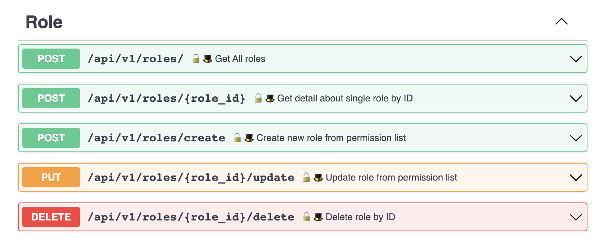
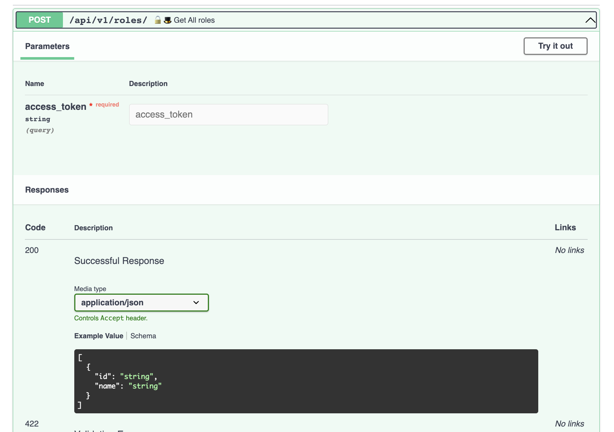
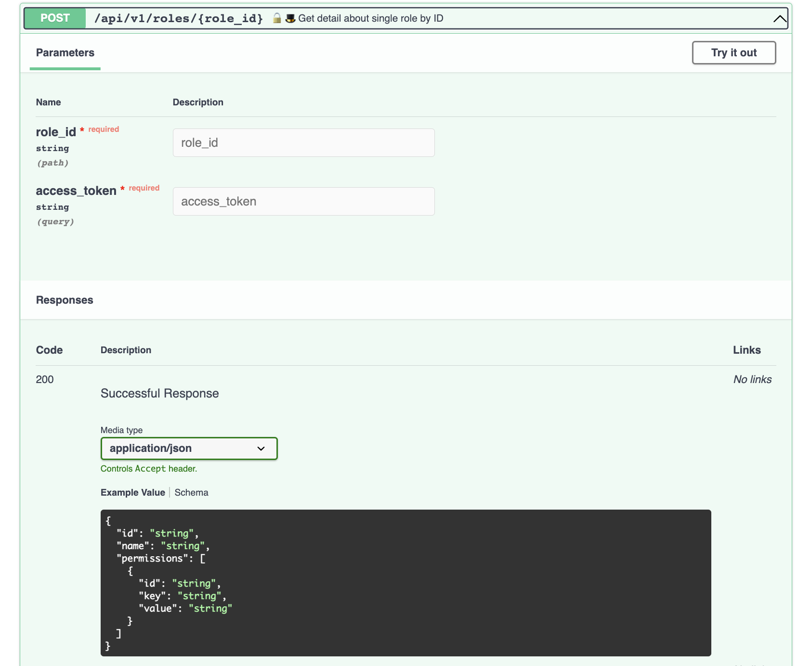
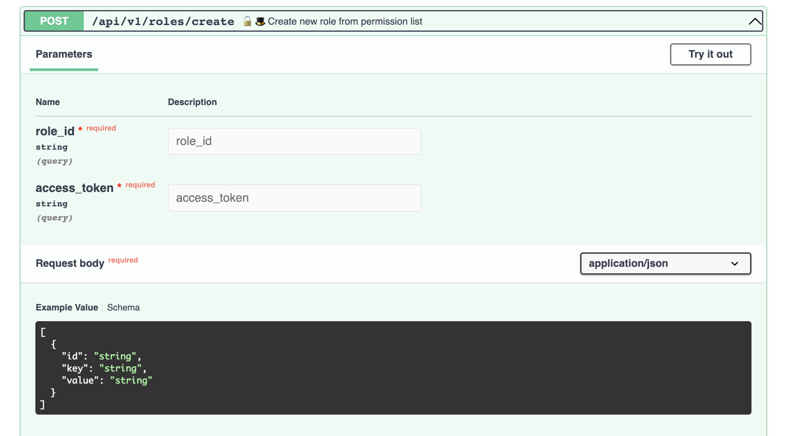

# API/roles

## API/roles/
    **Выходное значение:**
    Список ролей из БД

    
	**Логика:**
    1) Проверка уровня доступа, доступ для админа
	2) выдача списка ролей из БД

## API/roles/{role_id}

	**Параметры:**
	1) role_id
    2) accees_token

    **Выходное значение:**
    Полная информации из БД по роли (role_name, usernames, permissions)

	**Логика:**
    1) Проверка уровня доступа, доступ для админа
	1) выдача полной информации из БД по роли (role_name, usernames, permissions)

## API/role/create

	**Параметры:**
	1) role_name
	2) permissions
	3) usernames

    **Выходное значение:**
    Полная информации из БД по роли (role_name, usernames, permissions)

	Логика:
	1) проверка на совпадение role_name (запрос в БД)
	 - совпадение -> ошибка "роль с таким именем существует"
	 - несовпадение -> пункт 2
	2) добавление permissions (выбираем из готового списка по совпадению с исходными параметрами, необязательный параметр, роль может быть пустой). 
	 - при несовпадении параметра -> ошибка, что такого параметра нет
	3) добавление списка username (выбираем из готового списка по совпадению с исходными параметрами, необязательный параметр, роль может быть пустой)
	 - при несовпадении параметра -> ошибка, что такого параметра нет
	4) Сохранить. Запись роли в БД.

