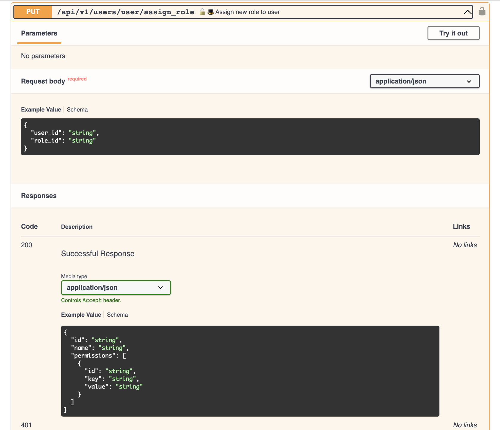
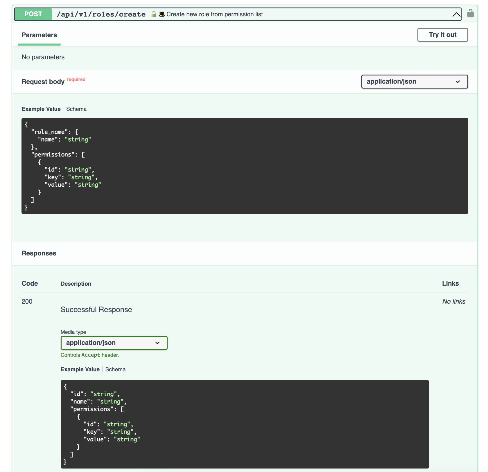

# API/user/user/assign_role
Назчение роли пользователю

#### Входные значения:
 - `user_id`
 - `role_id`

#### Выходные значения:
Полная информации из БД по назначенной роли пользователю (role_name, permissions)

#### Логика:
 - Проверка уровня доступа, доступ для админа
 - Привязка к новой ролик
 - выдача полной информации из БД по роли (`role_name`, `usernames`, `permissions`)

# API/roles

## API/roles/
#### Выходные значения:
 - Список ролей из БД

    
#### Логика:
 - Проверка уровня доступа, доступ для админа
 - Выдача списка ролей из БД

## API/roles/detail

#### Входные значения:
 - `role_id`
 - `accees_token`

#### Выходные значения:
Полная информации из БД по роли (`role_name`, `usernames`, `permissions`)

#### Логика:
- Проверка уровня доступа, доступ для админа
- Выдача полной информации из БД по роли (`role_name`, `usernames`, `permissions`)

## API/role/create

#### Входные значения:
-`role_name`
-`accees_token`
-`permissions`

#### Выходные значения:
Полная информации из БД по роли (`role_name`, `usernames`, `permissions`)

#### Логика:
 - Проверка уровня доступа, доступ для админа
 - проверка на совпадение `role_name` (запрос в БД)
     - совпадение -> ошибка "роль с таким именем существует"
     - несовпадение -> пункт 2
 - добавление permissions (выбираем из готового списка по совпадению с исходными параметрами, необязательный параметр, роль может быть пустой). 
    - при несовпадении параметра -> ошибка, что такого параметра нет
 - Сохранить. Запись роли в БД.

## API/role/update

#### Входные значения:
 - `role_id`
 - `accees_token`
 - `permissions`

#### Выходные значения:
Полная информации из БД по роли (role_name, usernames, permissions)

#### Логика:
 - Проверка уровня доступа, доступ для админа
 - замена `role_name`
    - совпадение -> ошибка "роль с таким именем существует" (поиск в БД по `role_name`, кроме текущего role_id)
    - несовпадение -> пункт 2
 - добавление permissions (выбираем из готового списка по совпадению с исходными параметрами, необязательный параметр, роль может быть пустой). 
    - при несовпадении параметра -> ошибка, что такого параметра нет
 - Сохранить изменения для `role_id` в БД.

## API/role/delete

#### Входные значения:
 - `role_id`

#### Выходные значения:
 - Сообщение об удалении

#### Логика:
 - Проверка уровня доступа, доступ для админа
 - роль имеет неудаленные usernames (получаем из БД)
    - да -> выдаем ошибку (у роли есть пользователи)
    - нет -> пункт 3
 - удалить роль из БД.

