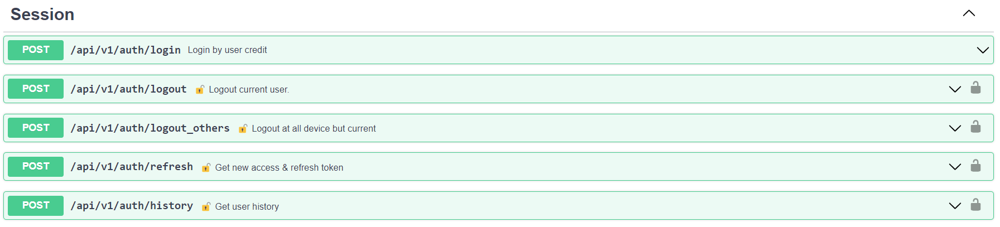

# Auth

## /api/v1/auth/login
Вход пользователя через учетные данные.

#### Входные значения:

- 200 в случае успешного входа с новыми `access_token` и `refresh_token`.
- 401 в случае невалидности токена.

#### Выходные значения:

- access_token – токен с коротким временем жизни (10-15 минут или несколько часов)
— многоразовый. Он содержит информацию о пользователе.
- refresh_token – токен с долгим временем жизни (от нескольких дней до месяца) —
одноразовый. Список актуальных refresh-токенов должен храниться в базе данных, чтобы соблюсти «одноразовость».

#### Логика:
1) Ищем пользователя с email, если существует проверяем соответствие хэша пароля
и хэша в бд таблице User.
2) Если соответствует генерируем `access_token` и `refresh_token`. 
3) В бд таблице UserHistory добавляется запись с `user_id`, `user_agent`, 
`ip`, `refresh_token`, `logout=false`. 

#### Ошибки:
Если комбинация неверная, получаем ошибку `401 Error: Unauthorized`. 

## /api/v1/auth/logout
Выход текущего пользователя.

#### Входные значения:

- access_token – токен.

#### Выходные значения:

- 200 в случае успешного выхода 
- 401 в случае невалидности токена.

#### Логика:
1) Проверяем на отсутствие `access_token` в блоклисте в redis.
2) Декодируем `access_token`, получаем `session_id`.
3) Обновляем запись в бд таблице `UserHistory` значение `logout` на `true`.
4) В redis в блоклист добавляем access_token 
с `ttl = access_token_expire_time - now().`

#### Ошибки:
Если токен невалидный, получаем ошибку `401 Error: Unauthorized`. 

## /api/v1/auth/logout_others
Выход текущего пользователя из других устройств.

#### Входные значения:

- access_token – токен.

#### Выходные значения:

- 200 в случае успешного выхода 
- 401 в случае невалидности токена.

#### Логика:
1) Проверяем на отсутствие `access_token` в блоклисте в redis.
2) Декодируем `access_token`, получаем значения `session_id` и `user_id`.
3) Обновляем запись в бд таблице `UserHistory` значение `logout` на `true`
у всех записей с фильтром по текущему пользователю, но не с текущим `session_id`.
4) В redis в блоклист добавляем access_token 
с `ttl = access_token_expire_time - now().`

#### Ошибки:
Если токен невалидный, получаем ошибку `401 Error: Unauthorized`. 

## /api/v1/auth/refresh
Обновление токенов.

#### Входные значения:

- refresh_token – токен.

#### Выходные значения:

- 200 в случае успешного обновления `access_token` и `refresh_token`.
- 401 в случае невалидности refresh-токена.

#### Логика:
1) Проверяем на отсутствие `access_token` в блоклисте в redis.
2) Декодируем `access_token`, получаем значения `session_id`.
3) Получаем запись в бд таблице `UserHistory` с соответствующим `session_id`.
4) Генерируем новые токены.
5) Обновляем refresh_token в записи из п.1.
6) Старый `access_token` кидаем в блоклист в redis 
с `ttl = access_token_expire_time - now().`.

#### Ошибки:
Если токен невалидный, получаем ошибку `401 Error: Unauthorized`. 

## /api/v1/auth/history
Получение активных сессий.

#### Входные значения:

- `access_token` – токен.

#### Выходные значения:

- 200 в случае успеха со списком активных сессий.
- 401 в случае невалидности refresh-токена.

#### Логика:
1) Проверяем на отсутствие `access_token` в блоклисте в redis.
2) Декодируем `access_token` и получаем `user_id`.
3) Получаем все записи в бд таблице `UserHistory` 
с соответствующим `user_id` и `logout=false`.

#### Ошибки:
Если токен невалидный, получаем ошибку `401 Error: Unauthorized`. 

