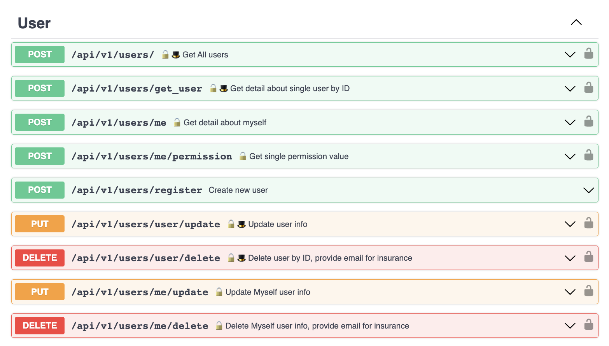
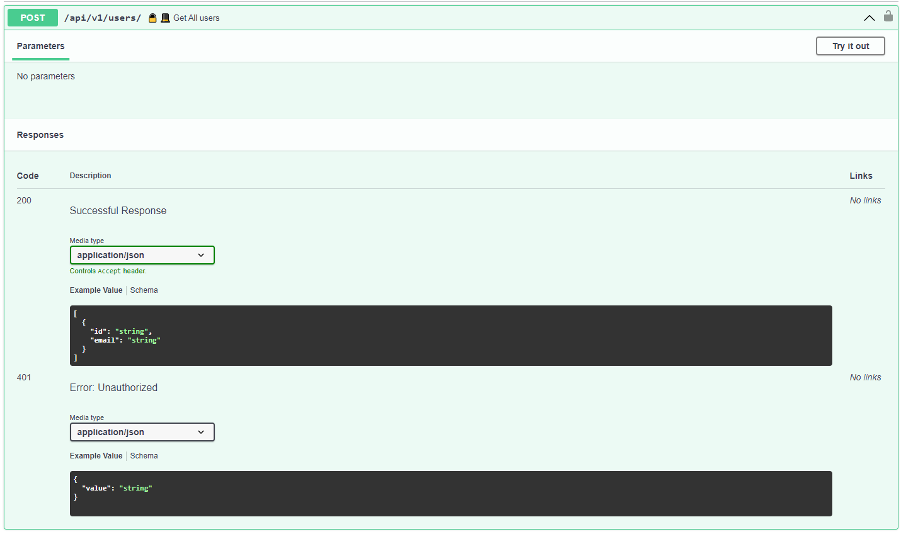
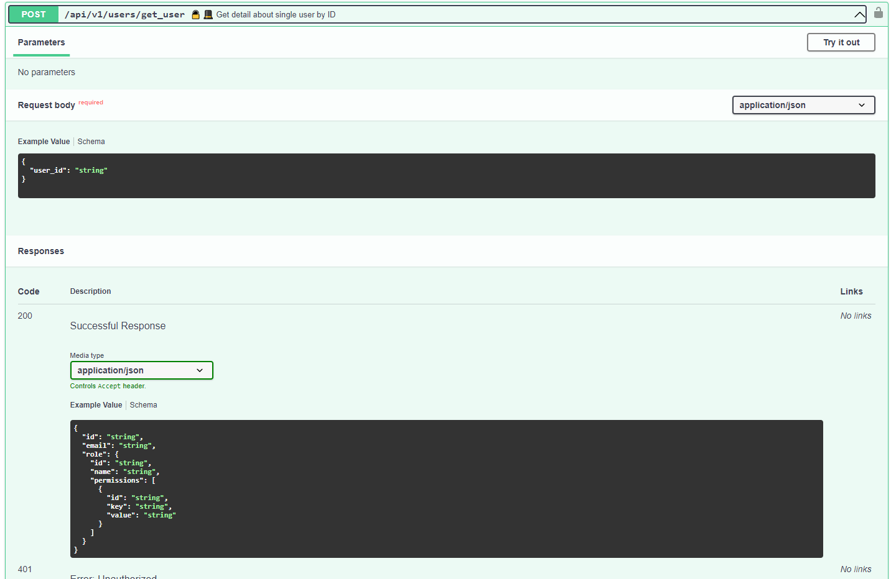
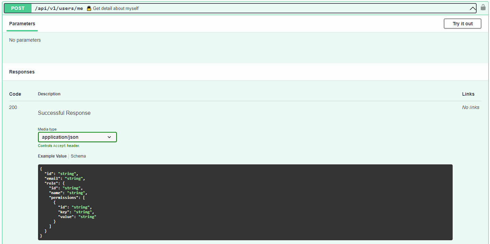
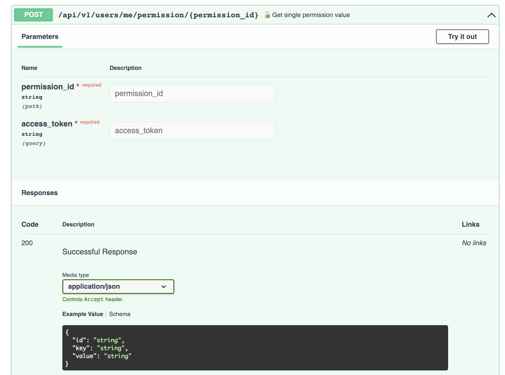
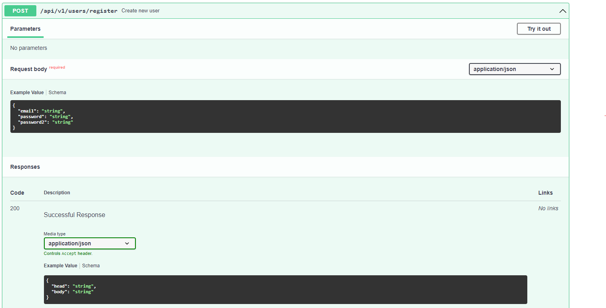
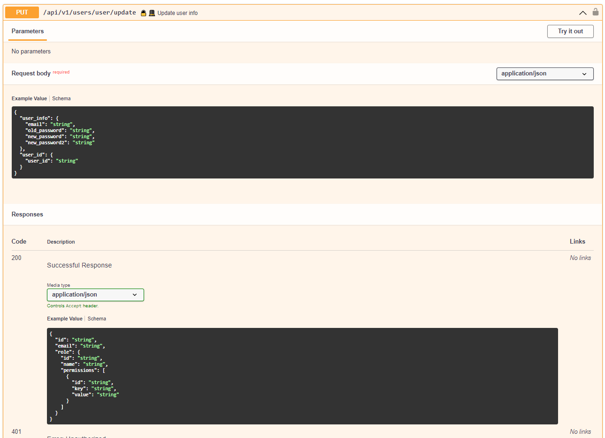
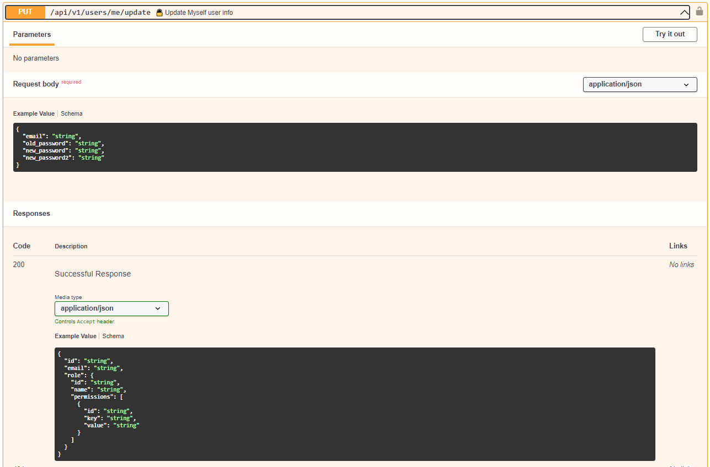
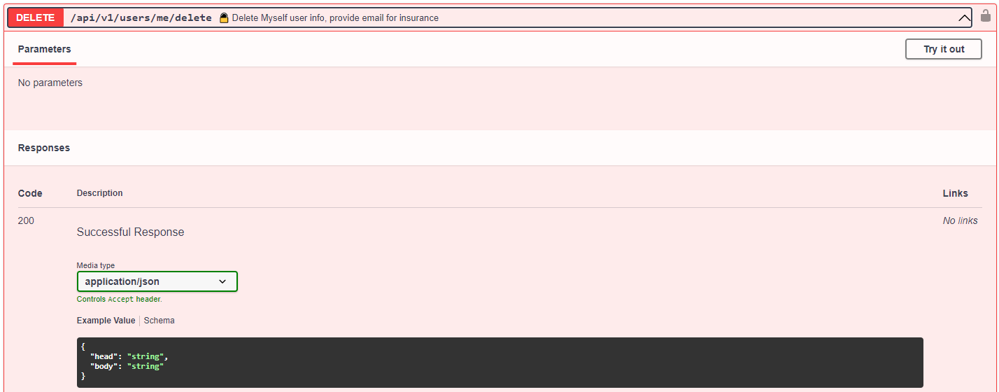

# API/users

## API/users/

    **Параметры:**
    1) access_token

    **Выходное значение:**
    Cписок данных о пользователях из БД 

    Логика:
    1) Проверка уровня доступа, доступ для админа
    2) Выдача информации из БД по всем пользователям

## API/users/get_user

	**Параметры:**
    1) access_token
    2) user_id

    **Выходное значение:**
    Полная информации из БД по пользователю в виде словаря

	Логика:
    1) Проверка уровня доступа в access_token, доступ для админа
	2) Выдача полной информации из БД по user

## API/users/me

	**Параметры:**
    1) access_token

    **Выходное значение:**
    Полная информации из БД по пользователю (себе) в виде словаря

	Логика:
    1) Проверка уровня доступа в access_token
	2) Выдача полной информации из БД по user

## API/users/me/permission/{permission_id}

	**Параметры:**
    1) access_token
    2) permission_id

    **Выходное значение:**
    Информация из БД по запрошенному доступу у пользователя 

    Логика:
    1) Проверка уровня доступа в access_token
    2) Выдача информации по запрошенному доступу пользователя из БД

## API/users/register:

	**Параметры:**
	1) email
	2) password
	3) password confirm

    **Выходное значение:**
    Общая информация о созданном пользователе (user_id, email)

	Логика:
	1) проверка на совпадение username (запрос в БД)
	 - совпадение -> ошибка "такой юзернейм существует"
	 - несовпадение -> пункт 2
	2) проверка валидности пароля (минимальное количество символов, сложность, отсутствие спецсимволов)
	 - невалиден -> ошибка валидности
	 - валиден -> шаг 3
	3) подтверждение пароля
	 - пароль не ввели -> ошибка, что надо ввести пароль
	 - пароль не совпдает -> ошибка, что пароль не совпадает
	 - пароль совпадает -> шаг 4
	4) запись нового юзера в БД
	5) получение access-токена
	6) запись рефреш токена в БД
	7) запись сессии в БД

## API/users/{user_id}/update:

	**Параметры:**
    1) access_token
    2) email
	3) password
	4) new password
	5) new password confirm
    
    **Выходное значение:**
    Общая информация об обновленном пользователе

	Логика:
    1) проверка токена
	2) смена email, проверка совпадения нового значения в БД
	 - несовпадение -> ошибка "такой пользователь не существует"
	 - совпадение -> пункт 3
	3) проверка правильности ввода старого пароля (сравнение хэшей)
	4) проверка валидности пароля (минимальное количество симовлов, сложность, отсутствие спецсимволов)
	 - невалиден -> ошибка валидности
	 - валиден -> шаг 5
	5) подтверждение пароля
	 - пароль не ввели -> ошибка, что надо ввести пароль
	 - пароль не совпдает -> ошибка, что пароль не совпадает
	 - пароль совпадает -> шаг 6
	6) подтверждение пароля
	 - пароль не ввели -> ошибка, что надо ввести пароль
	 - пароль не совпдает -> ошибка, что пароль не совпадает
	 - пароль совпадает -> шаг 4
	7) перезапись нового юзера в БД

## API/users/me/update:

	**Параметры:**
    1) access_token
    2) email
	3) password
	4) new password
	5) new password confirm
    
    **Выходное значение:**
    Общая информация об обновленном пользователе

	Логика:
    1) проверка токена
	2) смена email, проверка совпадения нового значения в БД
	 - несовпадение -> ошибка "такой пользователь не существует"
	 - совпадение -> пункт 3
	3) проверка правильности ввода старого пароля (сравнение хэшей)
	4) проверка валидности пароля (минимальное количество симовлов, сложность, отсутствие спецсимволов)
	 - невалиден -> ошибка валидности
	 - валиден -> шаг 5
	5) подтверждение пароля
	 - пароль не ввели -> ошибка, что надо ввести пароль
	 - пароль не совпдает -> ошибка, что пароль не совпадает
	 - пароль совпадает -> шаг 6
	6) подтверждение пароля
	 - пароль не ввели -> ошибка, что надо ввести пароль
	 - пароль не совпдает -> ошибка, что пароль не совпадает
	 - пароль совпадает -> шаг 4
	7) перезапись юзера в БД

## API/users/{user_id}/delete:

	**Параметры:**
    1) access_token
    2) user_id

    **Выходное значение:**
    Общая информация об удаленном пользователе

	Логика:
    1) проверка токена
	2) удаление сессии пользователя и токенов
    3) установка признака inactive=True в БД

## API/users/me/delete:

	**Параметры:**
    1) access_token

    **Выходное значение:**
    Общая информация об удаленном пользователе

	Логика:
    1) проверка токена
	2) удаление сессии пользователя и токенов
    3) установка признака inactive=True в БД

