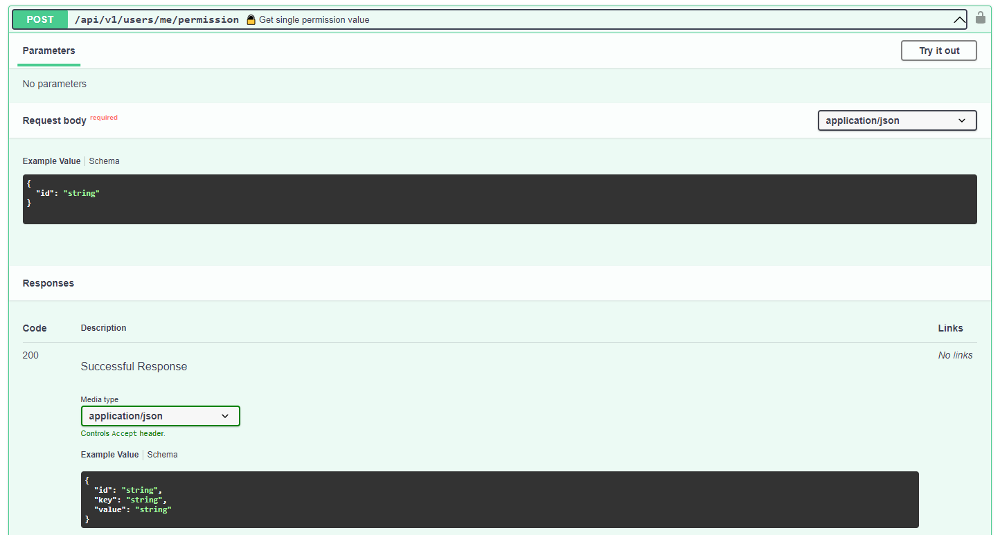

# API/users

## API/users/

    **Параметры:**
    1) access_token

    **Выходное значение:**
    Cписок данных о пользователях из БД 

    Логика:
    1) Проверка уровня доступа, доступ для админа
    2) Выдача информации из БД по всем пользователям

## API/users/{user_id}

	**Параметры:**
	1) user_id
    2) access_token

    **Выходное значение:**
    Полная информации из БД по пользователю в виде словаря

	Логика:
    1) Проверка уровня доступа, доступ для админа
	2) Выдача полной информации из БД по user

## API/users/me

	**Параметры:**
    1) access_token

    **Выходное значение:**
    Полная информации из БД по пользователю (себе) в виде словаря

	Логика:
    1) Проверка уровня доступа
	2) Выдача полной информации из БД по user

## API/users/me/permission/{permission_id}

	**Параметры:**
    1) access_token
    2) permission_id

    **Выходное значение:**
    Информация из БД по запрошенному доступу у пользователя 

    Логика:
    1) Проверка уровня доступа
    2) Выдача информации по доступу пользователя из БД

## API/users/register:

	**Параметры:**
	1) email
	2) password
	3) password confirm

    **Выходное значение:**
    df

	Логика:
	1) проверка на совпадение username (запрос в БД)
	 - совпадение -> ошибка "такой юзернейм существует"
	 - несовпадение -> пункт 2
	2) проверка валидности пароля (минимальное количество символов, сложность, отсутствие спецсимволов)
	 - невалиден -> ошибка валидности
	 - валиден -> шаг 3
	3) подтверждение пароля
	 - пароль не ввели -> ошибка, что надо ввести пароль
	 - пароль не совпдает -> ошибка, что пароль не совпадает
	 - пароль совпадает -> шаг 4
	4) запись нового юзера в БД
	5) запись хэша пароля в БД
	6) получение токена новым пользователем
	7) запись рефреш-токена в БД
	8) запись токена в редис
	9) запись сессии в БД с датой создания сессии

## API/user/login:

	Параметры:
	1) username
	2) password

	Логика:
	1) апи запрашивает БД на наличие username
	 - несовпадение -> ошибка "такой юзернейм не существует"
	 - совпадение -> пункт 2
	2) проверка валидности пароля (далем хэш, сравниваем с хэшем БД)
	 - несовпадение -> ошибка "пароль введен неверно" (реализовать 3 попытки ввода)
	 - совпадение -> пункт 3
	3) получение токена пользователем
	4) запись рефреш-токена в БД
	5) запись токена в редис
	6) запись сессии в БД с датой создания сессии

## API/user/edit:

	Параметры:
	1) username
	2) password
	3) new password
	4) new password confirm

	Логика (пользователь залогинен):
	1) смена юзернейма, проверка совпадения нового значения в БД
	 - несовпадение -> ошибка "такой юзернейм не существует"
	 - совпадение -> пункт 2
	2) проверка правильнсти ввода старого пароля
	3) проверка валидности пароля (минимальное количество симовлов, сложность, отсутствие спецсимволов)
	 - невалиден -> ошибка валидности
	 - валиден -> шаг 3
	4) подтверждение пароля
	 - пароль не ввели -> ошибка, что надо ввести пароль
	 - пароль не совпдает -> ошибка, что пароль не совпадает
	 - пароль совпадает -> шаг 4
	5) подтверждение пароля
	 - пароль не ввели -> ошибка, что надо ввести пароль
	 - пароль не совпдает -> ошибка, что пароль не совпадает
	 - пароль совпадает -> шаг 4
	6) запись нового занчения юзернейм в БД
	7) запись хэша пароля в БД (update)

## API/user/logout:

	Параметры:
	---

	Логика (пользователь залогинен):
	1) запись логаута в редис
	2) удаление токена из редис
	3) удаление рефреш-токена из БД

## API/user/history:

	Параметры:
	Нужны ли параметры за какой период смотреть?

	Логика (пользователь залогинен):
	1) запрос к БД
	2) вывод всех сессий в формате session-data : datetime
